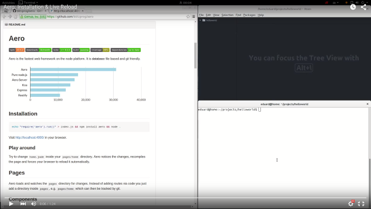
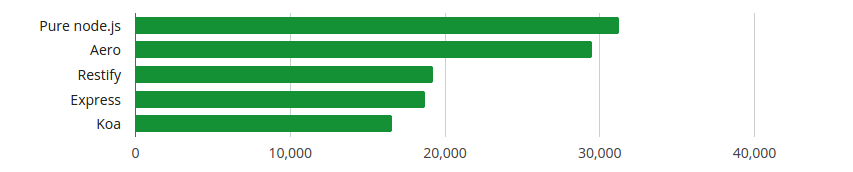
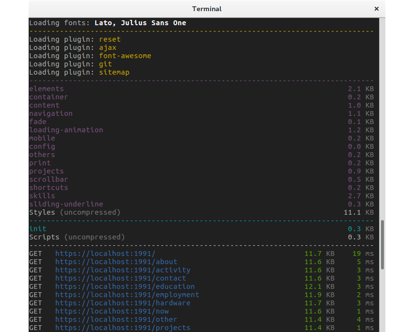

# Aero

[![NPM Version][npm-image]][npm-url]
[![NPM Downloads][downloads-image]][downloads-url]
[![Linux Build Status][travis-image]][travis-url]
[![Coverage Status][coveralls-image]][coveralls-url]
[![Dependencies][dependencies-image]][dependencies-url]

Might cause your phone to explode as your site will load too fast. You have been warned.

## Installation

```bash
echo "require('aero')().run()" > index.js && yarn add aero && node .
```

[](https://youtu.be/rcyO3C_cRB4)

Visit [http://localhost:4000/](http://localhost:4000/) in your browser and check out [Aero in 30 seconds](docs/QuickGuide.md).

## Features

* Routes your pages faster than you can say "Quidditch".
* Optimizes your website for high latency environments (a.k.a. mobile networks).
* Allows you to write modern ES 6 with [full browser compatibility](https://github.com/aerojs/aero-transpile-scripts).
* Validates HTML 5 for you. Just delete that [html5.validator.nu](https://html5.validator.nu) bookmark already.
* Lets you instantly see local changes in the browser. Use 2 monitors if you're the Al Capone of web devs.
* Make changes to a prototype while your boss is watching? Aero can [update your live server on every git commit](https://github.com/aerojs/aero-git).
* Prevents typical *"Oops I forgot the parameter checks"* by testing all routes.
* *99% of execution time is spent in 1% of your code.* Find that 1% by looking at response time & size of your pages.
* Reduces your site's bandwidth hunger by using brotli instead of gzip for static contents.
* Free ice cream: HTTP/2, IPv6, Web Manifest.
* More ice cream via plugins: https://github.com/aerojs

## Documentation

* [Configuration](docs/Configuration.md)
* [Pages](docs/Pages.md)
* [Templates](docs/Templates.md)
* [Controllers](docs/Controllers.md)
* [Styles](docs/Styles.md)
* [Scripts](docs/Scripts.md)
* [Layouts](docs/Layouts.md)
* [Plugins](docs/Plugins.md)
* [Startup](docs/Startup.md)
* [Parameters](docs/Parameters.md)
* [Events](docs/Events.md)
* [HTTP/2](docs/HTTP2.md)
* [Manifest](docs/Manifest.md)
* [API](docs/API.md)

## Benchmark

[](https://github.com/blitzprog/webserver-benchmarks)

## Screenshot



## Examples

URL                                                                | Source | Size | Speed
------------------------------------------------------------------ | ------ | ---- | ---------
[blitzprog.org](https://blitzprog.org)                             | [view source](https://github.com/blitzprog/blitzprog.org)                 | 12 KB | [100 / 100](https://developers.google.com/speed/pagespeed/insights/?url=https://blitzprog.org&tab=desktop)
[notify.moe](https://notify.moe)                                   | [view source](https://github.com/animenotifier/notify.moe)                | 15 KB | [100 / 100](https://developers.google.com/speed/pagespeed/insights/?url=https://notify.moe&tab=desktop)
[nihongo-center.com](https://nihongo-center.com)                   | [view source](https://github.com/nihongocenter/nihongo-center.com)        | 13 KB | [100 / 100](https://developers.google.com/speed/pagespeed/insights/?url=https://nihongo-center.com&tab=desktop)
[increasedvoices.com](http://increasedvoices.com)                  | [view source](https://github.com/mysticalnight/increasedvoices.com)       |  5 KB | [98 / 100](https://developers.google.com/speed/pagespeed/insights/?url=http://increasedvoices.com&tab=desktop)

---

**Size**: Includes compressed **HTML**, **CSS** and **JS** of the frontpage. Excludes external videos and images.  
**Speed**: Measured by **Google PageSpeed**. Does not represent real-world loading speed.

---

[](https://github.com/blitzprog)

[npm-image]: https://img.shields.io/npm/v/aero.svg
[npm-url]: https://npmjs.org/package/aero
[travis-image]: https://img.shields.io/travis/aerojs/aero/master.svg?label=linux
[travis-url]: https://travis-ci.org/aerojs/aero
[coveralls-image]: https://img.shields.io/coveralls/aerojs/aero/master.svg
[coveralls-url]: https://coveralls.io/r/aerojs/aero?branch=master
[downloads-image]: https://img.shields.io/npm/dm/aero.svg
[downloads-url]: https://npmjs.org/package/aero
[dependencies-image]: https://david-dm.org/aerojs/aero.svg
[dependencies-url]: https://david-dm.org/aerojs/aero
