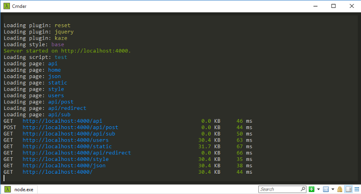

# Aero

[![NPM Version][npm-image]][npm-url]
[![NPM Downloads][downloads-image]][downloads-url]
[![Coverage Status][coveralls-image]][coveralls-url]
[![Linux Build Status][travis-image]][travis-url]
[![windows Build Status][appveyor-image]][appveyor-url]
[![Dependencies][dependencies-image]][dependencies-url]

Aero is the fastest web framework on the node platform. It is ~~database~~ file based and git friendly.


## Installation

```bash
echo "require('aero').run()" > index.js && npm i aero --production && node .
```

Visit [http://localhost:4000/](http://localhost:4000/) in your browser.

[](https://youtu.be/rcyO3C_cRB4)

### Play around

Try to change `home.jade` inside your `pages/home` directory. Aero notices the changes, recompiles the page and forces your browser to reload it automatically.

## TL;DR - Aero in 30 seconds

* Instead of routing via code you just create a directory inside `pages`
* A page can have a template, style sheet, a controller and a JSON file:
	* `hello/hello.jade`
	* `hello/hello.styl`
	* `hello/hello.js`
	* `hello/hello.json`
* A controller is just an object that defines `get` or `post` methods. Or whatever you need.
```js
module.exports = { get: function(request, response) { response.end('Hello') } }
```
* To feed dynamic data from a controller to a template just pass it to `response.render`
```js
response.render({ message: 'You requested ' + request.url })
```
```jade
h1= message
```
* Static pages only require a template file, e.g. `hello.jade`
* API pages only require a controller, e.g. `hello.js`
* Aero is powered by its own blazingly fast web server which has Express-like API
```js
aero.get('/', (req, res) => res.end('Hello World'))
```

## Pages

Aero loads and watches the `pages` directory for changes. Instead of adding routes via code you just add a directory inside `pages`, e.g. `pages/home` which can then be tracked by git.

### Components

For a page to be loaded by Aero it needs a `.jade` template or a `.js` controller.

Page type                        | .jade | .js
-------------------------------- | ----- | ---
Static page                      | ✓    |
Dynamic page (full control, API) |       | ✓
Dynamic page (with template)     | ✓    | ✓

Adding a `.styl` file to the page will load the style sheet on this page only.

Adding a `.json` file will add all its data to your `.jade` template automatically.

For example the `helloworld` directory may contain:

* `helloworld.jade`
* `helloworld.styl`
* `helloworld.json`
* `helloworld.js`

### Subdirectories

Aero scans your pages directory recursively and therefore also adds routes for subpages automatically:

```
/api
/api/users
/api/users/uploads
```

### Change URL for a page

By default Aero will create a route based on the directory name. If you don't like the default behaviour you can overwrite the route with the `url` parameter in the `.json` file:

```json
{
	"url": "blog/categories"
}
```

For the frontpage you should use an empty string.

## Styles

Style sheets are written in Stylus format using the `.styl` file extension inside the `styles` directory.

Style loading order needs to be defined in your `config.json`. If you have 3 files called `first.styl`, `second.styl` and `third.styl`, specify the loading order in an array:

```json
"styles": [
	"first",
	"second",
	"third"
]
```

## Scripts

You can place browser scripts in the `scripts` directory.
These will be global and therefore available on every page.

The loading order for global scripts needs to be defined in your `config.json`. If you have 3 files called `first.js`, `second.js` and `third.js`, specify the loading order in an array:

```json
"scripts": [
	"first",
	"second",
	"third"
]
```

If you want to add a browser script to a single page only you should use a `.browser.js` file inside the page directory (warning: **experimental** feature, use at your own risk). If your page is called `home`, the file name should be `home.browser.js`.

## Controllers

A controller is a module that exports an object with either a `get` or a `render` method. Here is an example for a controller which outputs "Hello World":

```js
module.exports = {
	get: function(request, response) {
		response.end('Hello World')
	}
}
```

The above controller works as a standalone (without any templates or other files required). Here's a controller that requires a `.jade` template inside the same directory when you use the `render` method of the response object:

```js
module.exports = {
	get: function(request, response) {
		response.render({
			myJadeParameter: 'Hello World'
		})
	}
}
```

Controllers are **not required** to serve a static page. Only add a controller if you have dynamic data that you need to use inside your template.

Other request handlers, e.g. `POST` and `DELETE`, can be added to the same controller:

```js
module.exports = {
	get: function(request, response) {
		response.end('get it')
	}

	post: function(request, response) {
		response.end('post it')
	}

	delete: function(request, response) { // DRAFT: Not supported yet
		response.end('delete it')
	}
}
```

## Live reload

Templates, controllers, scripts, styles and JSON files are reloaded when you save them in your editor and cause an automatic browser refresh. There is no need to restart Aero when editing your project, therefore boosting your productivity.

## HTML5 and JSON validation

All of your HTML and JSON output is automatically checked on every change.
HTML5 is linted via `html5-lint` which uses https://html5.validator.nu/.

## Express-like API

```js
// Routing
aero.get('/hello', function(request, response) {
	response.end('Hello!')
})
```

```js
// Regex routing
aero.get(/^\+(.*)$/, function(request, response) {
	response.end('Google+ style routing')
})
```

```js
// Middleware
aero.use(function(request, response, next) {
	console.log(request.url) // Log every request
	next()                   // Continue the call chain
})
```

```js
// Passport.js works out-of-the-box
aero.use(require('passport').initialize())
```

```js
// Multiple `use` in one call
let session = require('express-session')
let passport = require('passport')

let options = {
	secret: 'keyboard cat',
	saveUninitialized: true,
	resave: false
}

aero.use(
	session(options),
	passport.initialize(),
	passport.session()
)
```

Aero aims to be as Express compatible as possible, however 100% API compatibility is not the goal.

## Colored output



## Written in ES 6

Aero uses the latest ES 6 features present in node 4.x and 5.x. However if performance turns out to be an issue, the ES 5 way should be prioritized in the code.

## Other

* [Goals](https://github.com/blitzprog/aero/blob/master/docs/goals.md)
* [Status](https://github.com/blitzprog/aero/blob/master/docs/status.md)

## Similar software

Similar web servers:

* [Express](http://expressjs.com/)
* [Restify](http://mcavage.me/node-restify/)
* [Koa](http://koajs.com/)
* [Hapi](http://hapijs.com/)

More or less similar frameworks:

* [Sails](http://sailsjs.org/)
* [Keystone](http://keystonejs.com/)
* [Meteor](https://www.meteor.com/)
* [Total](https://www.totaljs.com/)

## Websites using Aero

URL                                                                | Source
------------------------------------------------------------------ | ------
[blitzprog.org](http://blitzprog.org)                              | [view source](https://github.com/blitzprog/blitzprog.org)
[my.nihongo-center.com](http://my.nihongo-center.com)              | [view source](https://github.com/blitzprog/nihongo-center.com)
[increasedvoices.com](http://increasedvoices.com)                  | [view source](https://github.com/blitzprog/increasedvoices.com)
[animereleasenotifier.com](https://animereleasenotifier.com)       | [view source](https://github.com/blitzprog/animereleasenotifier.com)
Yours? [Share your website!](https://github.com/aerojs/aero/edit/master/README.md)                               | -

[npm-image]: https://img.shields.io/npm/v/aero.svg
[npm-url]: https://npmjs.org/package/aero
[travis-image]: https://img.shields.io/travis/aerojs/aero/master.svg?label=linux
[travis-url]: https://travis-ci.org/aerojs/aero
[appveyor-image]: https://img.shields.io/appveyor/ci/blitzprog/aero.svg?label=windows
[appveyor-url]: https://ci.appveyor.com/project/blitzprog/aero
[coveralls-image]: https://img.shields.io/coveralls/aerojs/aero/master.svg
[coveralls-url]: https://coveralls.io/r/aerojs/aero?branch=master
[downloads-image]: https://img.shields.io/npm/dm/aero.svg
[downloads-url]: https://npmjs.org/package/aero
[dependencies-image]: https://david-dm.org/aerojs/aero.svg
[dependencies-url]: https://david-dm.org/aerojs/aero