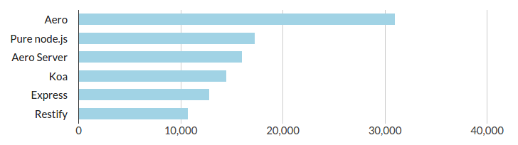

# Aero

[![NPM Version][npm-image]][npm-url]
[![NPM Downloads][downloads-image]][downloads-url]
[![Node.js Version][node-version-image]][node-version-url]
[![Build Status][travis-image]][travis-url]
[![Coverage Status][coveralls-image]][coveralls-url]
[![Dependencies][dependencies-image]][dependencies-url]

Aero is the fastest web framework on the node platform. It is based on [Jade](http://jade-lang.com/) and [Stylus](https://learnboost.github.io/stylus/).

## Installation

```bash
echo "require('aero').run()" > index.js && npm install aero && node .
```

Visit [http://localhost:4000/](http://localhost:4000/) in your browser.

### Play around

Try to change the `helloworld.jade` inside your `pages/helloworld` directory. Aero notices the changes, recompiles the page and forces your browser to reload it automatically.

## Pages

Aero loads and watches the `pages` directory. For example the `helloworld` directory can contain:

* `helloworld.jade`
* `helloworld.styl`
* `helloworld.json`
* `helloworld.js`

### Components

For a page to be recognized by Aero it needs a `.jade` template or a `.js` controller.

Page type                   | .jade | .js
--------------------------- | ------|-----
Static page                 | ✓     |  
Dynamic page (full control) |       | ✓
Dynamic page with template  | ✓     | ✓

Adding a `.styl` file to the page will load the style sheet on this page only.

Adding a `.json` file will add all its data to your `.jade` template automatically.

### Subdirectories

Aero scans your pages directory recursively and therefore also adds routes for subpages automatically:

```
/api
/api/users
/api/users/uploads
```

### Change URL for a page

By default Aero will create a route based on the directory name. If you don't like the default behaviour you can overwrite the route with the `url` parameter in the `.json` file:

```json
{
	"url": "blog/categories"
}
```

For the frontpage you should use an empty string.

## Benchmark



[View source](https://github.com/blitzprog/webserver-benchmarks)

## Documentation

* [Goals](https://github.com/blitzprog/aero/blob/master/docs/goals.md)

## Similar software

Similar web servers:

* [Express](http://expressjs.com/)
* [Restify](http://mcavage.me/node-restify/)
* [Koa](http://koajs.com/)
* [Hapi](http://hapijs.com/)

Similar frameworks:

* [Sails](http://sailsjs.org/)
* [Keystone](http://keystonejs.com/)

## Websites using Aero

* [blitzprog.org](http://blitzprog.org) ([view source](https://github.com/blitzprog/blitzprog.org))
* [my.nihongo-center.com](http://my.nihongo-center.com) ([view source](https://github.com/blitzprog/nihongo-center.com))
* [increasedvoices.com](http://increasedvoices.com) ([view source](https://github.com/blitzprog/increasedvoices.com))
* [animereleasenotifier.com](https://animereleasenotifier.com) ([view source](https://github.com/blitzprog/animereleasenotifier.com))

[npm-image]: https://img.shields.io/npm/v/aero.svg
[npm-url]: https://npmjs.org/package/aero
[node-version-image]: https://img.shields.io/node/v/aero.svg
[node-version-url]: http://nodejs.org/download/
[travis-image]: https://img.shields.io/travis/blitzprog/aero/master.svg
[travis-url]: https://travis-ci.org/blitzprog/aero
[coveralls-image]: https://img.shields.io/coveralls/blitzprog/aero/master.svg
[coveralls-url]: https://coveralls.io/r/blitzprog/aero?branch=master
[downloads-image]: https://img.shields.io/npm/dm/aero.svg
[downloads-url]: https://npmjs.org/package/aero
[dependencies-image]: https://david-dm.org/blitzprog/aero.svg
[dependencies-url]: https://david-dm.org/blitzprog/aero